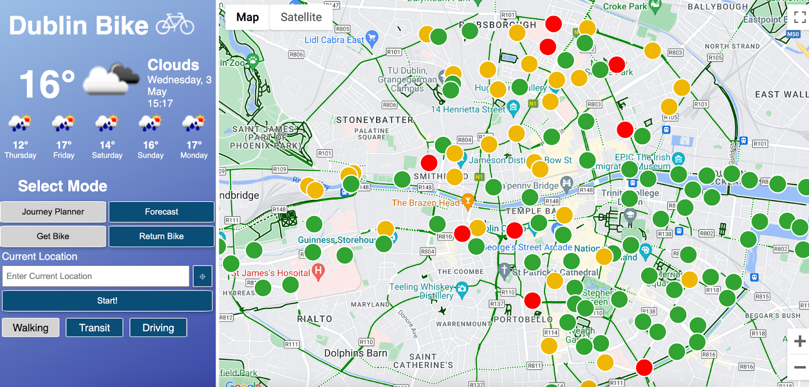
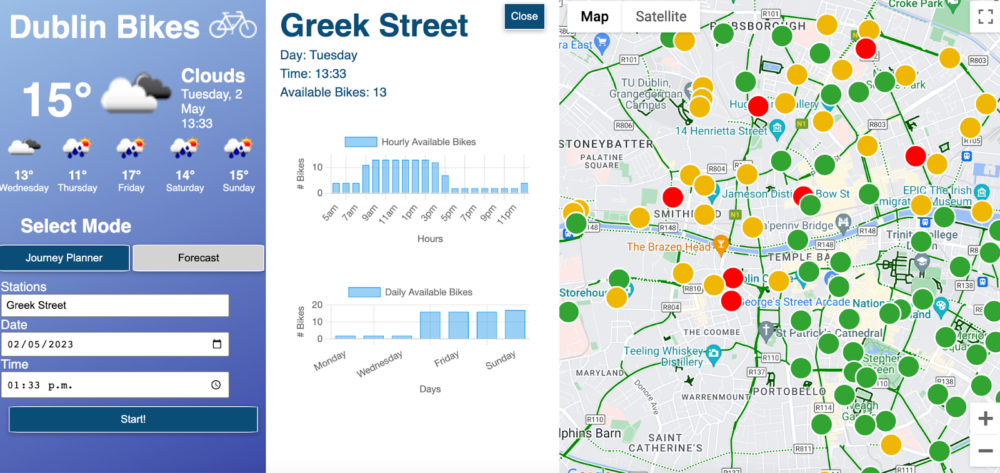

# Dublin Bikes Journey Planner
This repository hosts code for a journey planner Flask application that handles tasks such as data processing, visualisation, and machine learning predictions. These tasks are focused on the Dublin Bikes bike rental service available in Dublin, Ireland.  
## Features
The application provides live occupancy data for each Dublin Bikes station; users can input a location and toggle between two modes that will present them with either the closest station with available bikes or the closest station with free stands to return a bike.  Users can then utilise routing functionality to view the best route to their ideal station whether on foot, by car, or by public transport.  Users can also plan for a future journey, and will be presented with the predicted availability for their chosen station at their chosen time and day. This prediction is calculated using a machine learning model trained on weather data scraped from OpenWeather (https://openweathermap.org/api/one-call-3) and bike data scraped from JCDecaux (https://developer.jcdecaux.com/#/opendata/vls?page=getstarted) and stored in an RDS database which is linked to an EC2 instance.  
## Contact
If you have any questions or need further information, please contact the project owner or contributors via the repository.

